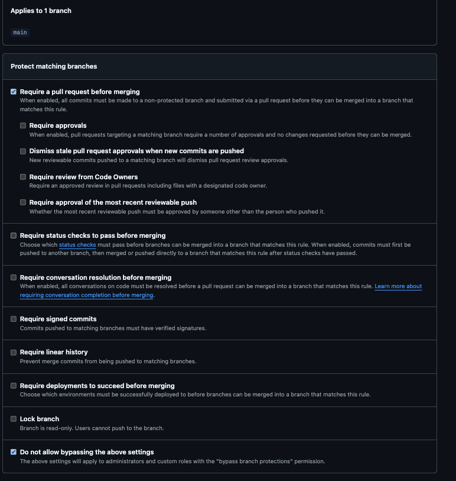
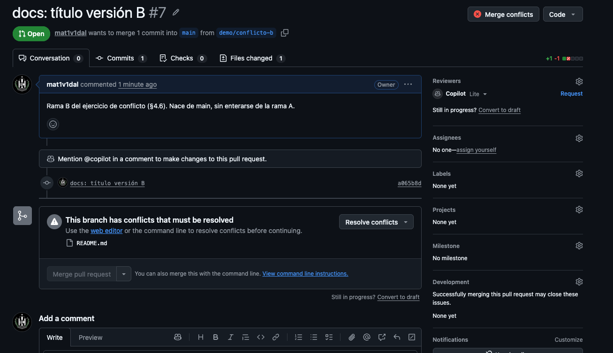
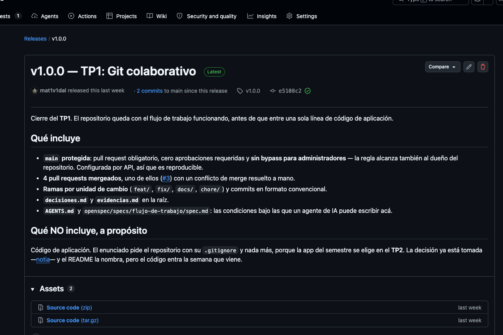
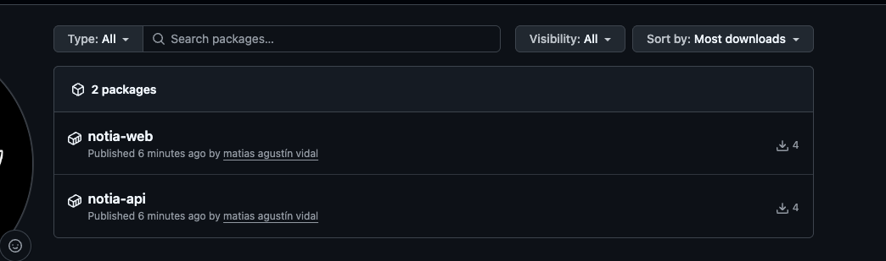

# Evidencias

---

## TP1 — Git colaborativo

### 1. Push directo a `main` rechazado

La protección alcanza también al dueño del repositorio (*Do not allow
bypassing*). Intento real contra `origin/main`:

```console
$ echo "" >> .gitignore
$ git commit -am "test: intento de push directo"
$ git push
remote: error: GH006: Protected branch update failed for refs/heads/main.
remote:
remote: - Changes must be made through a pull request.
To https://github.com/mat1v1dal/notia-ingsoft3.git
 ! [remote rejected] main -> main (protected branch hook declined)
error: failed to push some refs to 'https://github.com/mat1v1dal/notia-ingsoft3.git'
```

`protected branch hook declined` es el rechazo **del lado del servidor**: el
commit llegó a existir en local, pero nunca entró a `main`. Después se deshizo
con `git reset --hard HEAD~1`.

La configuración que lo produce, leída de vuelta desde la API:

```console
$ gh api repos/mat1v1dal/notia-ingsoft3/branches/main/protection \
    -q '{aprobaciones: .required_pull_request_reviews.required_approving_review_count, sin_bypass: .enforce_admins.enabled}'
{"aprobaciones":0,"sin_bypass":true}
```



Las dos casillas que importan: **Require a pull request before merging**
tildada con *Require approvals* en cero, y abajo de todo **Do not allow
bypassing the above settings**, que es la que hace que la regla me alcance
también a mí.

### 2. El PR con el conflicto

[PR #3 — *docs: nombrar la app del semestre*](../../pull/3)

Al mergearse el [PR #2](../../pull/2), que reescribió el mismo párrafo del
README, GitHub marcó el #3 como no mergeable:

```console
$ gh pr view 3 --json number,mergeable,mergeStateStatus
{"mergeStateStatus":"DIRTY","mergeable":"CONFLICTING","number":3}
```

En la web esto se ve como *"This branch has conflicts that must be resolved"*,
con el botón de merge deshabilitado.



> ⚠️ La captura corresponde al **PR #7**, no al #3. GitHub deja de
> mostrar el cartel de conflicto una vez que el pull request está mergeado, así
> que el ejercicio se reprodujo en dos ramas descartables
> (`demo/conflicto-a` y `demo/conflicto-b`) para poder fotografiarlo. El
> conflicto original del PR #3 es el que está documentado arriba y sigue
> navegable en el historial: el commit de merge `5b7d0e9` dentro de esa rama
> sólo existe porque hubo que resolverlo a mano.

### 3. Los marcadores del conflicto

Traer `main` a la rama para resolver en local:

```console
$ git merge origin/main
Auto-merging README.md
CONFLICT (content): Merge conflict in README.md
Automatic merge failed; fix conflicts and then commit the result.
```

Y el archivo, con las dos versiones enfrentadas:

```text
<<<<<<< HEAD
La **app del semestre** es [notia](https://github.com/mat1v1dal/notia) y entra
a este mismo repositorio en el TP2. Hasta entonces acá vive el flujo de
trabajo y nada más.
=======
La **app del semestre** se elige en el TP2 y entra a este mismo repositorio,
con su propio arranque documentado. Hasta entonces acá vive el flujo de
trabajo y nada más: no hay nada para levantar todavía.
>>>>>>> origin/main
```

- `<<<<<<< HEAD` … `=======` → lo que traía **mi rama**.
- `=======` … `>>>>>>> origin/main` → lo que traía **main**.

Resuelto quedándome con los dos lados, porque eran datos complementarios y no
versiones alternativas del mismo dato. El razonamiento completo está en
[`decisiones.md`](decisiones.md).

### 4. La release publicada

Tag `v1.0.0` sobre `main`, con su release en la pestaña *Releases*.



---

## Resumen del historial

```console
$ gh pr list --state merged --json number,title
#1  docs(sdd): fijar el flujo de trabajo y las condiciones del uso de IA
#2  docs: aclarar que todavía no hay nada para levantar
#3  docs: nombrar la app del semestre          ← el del conflicto
#4  docs: decisiones y evidencias del TP1
```

Todo cambio entró por pull request, incluidos estos dos archivos: es lo que
las protecciones dejaron configurado y no hay forma de saltearlo.

---

## TP2 — Contenedores: la app del semestre

### 1. `docker compose up -d` desde cero

```console
$ docker compose down -v
 Volume notia_pgdata  Removed

$ cp .env.example .env      # y completar las cuatro variables
$ docker compose up -d
 Container notia-postgres-1   Healthy
 Container notia-notia-api-1  Started
 Container notia-notia-web-1  Started

$ docker compose ps --format 'table {{.Service}}\t{{.Status}}\t{{.Ports}}'
SERVICE     STATUS                    PORTS
notia-api   Up 6 seconds (healthy)    3000/tcp
notia-web   Up 6 seconds              0.0.0.0:8099->80/tcp
postgres    Up 12 seconds (healthy)   5432/tcp
```

`notia-api` no figura con puerto publicado a propósito: **sólo es alcanzable
desde la red interna**. El único punto de entrada es nginx.

### 2. El sistema funcionando end-to-end

A través de nginx, que es como lo ve el navegador:

```console
$ curl -o /dev/null -w "%{http_code} %{content_type}\n" http://localhost:8099/
200 text/html                       ← la SPA, servida por nginx

$ curl http://localhost:8099/salud
{"ok":true}                         ← proxy al backend, por nombre de servicio

$ curl -o /dev/null -w "%{http_code}\n" http://localhost:8099/api/items
401                                 ← sin sesión no se pasa

$ curl -o /dev/null -w "%{http_code}\n" http://localhost:8099/buscar
200                                 ← lo resuelve el router del cliente
```

Login y creación de un item real, contra el sistema levantado:

```console
$ curl -c j -X POST http://localhost:8099/login \
    -H 'content-type: application/json' -d '{"password":"..."}'
{"ok":true}

$ curl -b j -X POST http://localhost:8099/api/items \
    -H 'content-type: application/json' \
    -d '{"content":"Entregar el TP2 de IngSoft3","context":"facultad"}'
{"id":1,"content":"Entregar el TP2 de IngSoft3","context":"facultad",
 "source":"web","createdAt":"2026-08-31T17:20:06.642Z", ...}
```

### 3. La prueba de persistencia

**`down` conserva los datos.** El item creado arriba, después de destruir y
recrear los contenedores:

```console
$ docker compose down
 Container notia-postgres-1  Removed
 Container notia-notia-api-1 Removed
 Container notia-notia-web-1 Removed

$ docker compose up -d
$ curl -b j http://localhost:8099/api/items
[{"id":1,"content":"Entregar el TP2 de IngSoft3", ...}]   ← sobrevivió
```

**`down -v` los borra.** Mismo ciclo, agregando `-v`:

```console
$ docker compose down -v
 Volume notia_pgdata  Removing
 Volume notia_pgdata  Removed

$ docker compose up -d
$ curl -b j http://localhost:8099/api/items
[]                                                        ← base vacía
```

La diferencia entre los dos comandos es el volumen: los contenedores son
descartables, el volumen no. Las migraciones vuelven a correr solas al
arrancar contra una base vacía.

> 💡 Detalle que apareció probando: la cookie de sesión sigue siendo válida
> después de `down -v`. No es un bug — se firma con `APP_SECRET` y no se guarda
> en la base, así que borrar la base no la invalida.

### 4. Tamaño: imagen final vs imagen con el toolchain

```console
$ docker build --target deps -f Dockerfile.api -t notia-api-deps:medicion .
$ docker images --format '{{.Repository}}:{{.Tag}}\t{{.Size}}'
notia-api-deps:medicion                 553MB   ← etapa con todo el toolchain
ghcr.io/mat1v1dal/notia-api:v0.1.0      343MB   ← -38%
ghcr.io/mat1v1dal/notia-web:v0.1.0       92.1MB ← nginx + estáticos, sin Node
```

Lo que se descarta entre `deps` y `runtime` es typescript, vitest, vite,
drizzle-kit y sus árboles de dependencias: 210 MB que no se usan en producción.

### 5. Las imágenes publicadas en el registry

```console
$ docker push ghcr.io/mat1v1dal/notia-api:v0.1.0
v0.1.0: digest: sha256:17f695240fdd83e93ac8709dfbd96e0c4e9ab4e6776217474baee21a53ec5206 size: 856

$ docker push ghcr.io/mat1v1dal/notia-web:v0.1.0
v0.1.0: digest: sha256:3800d6f0126a446afc83a755b3cfd8b8bc65cf9464278564112e2df912354b72 size: 856
```

Los digests son la identidad real de cada imagen: el tag `v0.1.0` es una
etiqueta que se puede mover, el `sha256` no. Es el concepto de **release
inmutable** que se trabaja en el TP7.



Los dos paquetes quedaron con visibilidad **pública**:

```console
$ gh api /user/packages/container/notia-api -q .visibility
public
$ gh api /user/packages/container/notia-web -q .visibility
public
```

Que el label diga *Public* es una cosa; que un tercero pueda bajarlas es la
que importa. Pidiendo un token anónimo al registry —sin ninguna credencial— y
consultando el manifiesto de cada imagen:

```console
$ TOKEN=$(curl -s "https://ghcr.io/token?scope=repository:mat1v1dal/notia-api:pull&service=ghcr.io" | jq -r .token)
$ curl -o /dev/null -w '%{http_code}\n' -H "Authorization: Bearer $TOKEN" \
    https://ghcr.io/v2/mat1v1dal/notia-api/manifests/v0.1.0
200

$ # ídem notia-web
200
```

`200` sin login es la prueba de que la imagen es accesible para cualquiera.
Si fueran privadas, el registry devolvería `401`.

### 6. La variante de registry, probada de verdad

Para que el pull fuera real y no un falso positivo contra la cache local,
primero se borraron **todas** las imágenes del proyecto:

```console
$ docker compose down -v
 Volume notia_pgdata  Removed

$ docker rmi -f ghcr.io/mat1v1dal/notia-api:v0.1.0 ghcr.io/mat1v1dal/notia-web:v0.1.0 ...
$ docker images | grep -i notia
(ninguna)
```

Y recién entonces se levantó el sistema con la variante de registry:

```console
$ docker compose -f docker-compose.registry.yml up -d
 notia-api Pulling
 notia-web Pulling
 ...
 notia-web Pulled
 notia-api Pulled

$ docker compose -f docker-compose.registry.yml ps --format 'table {{.Service}}\t{{.Image}}\t{{.Status}}'
SERVICE     IMAGE                                STATUS
notia-api   ghcr.io/mat1v1dal/notia-api:v0.1.0   Up 6 seconds (healthy)
notia-web   ghcr.io/mat1v1dal/notia-web:v0.1.0   Up 6 seconds
postgres    postgres:16-alpine                   Up 12 seconds (healthy)
```

La columna `IMAGE` es la prueba: los contenedores corren sobre las imágenes
**del registry**, no sobre un build local. Y el sistema responde igual:

```console
$ curl -o /dev/null -w "%{http_code} %{content_type}\n" http://localhost:8099/
200 text/html

$ curl http://localhost:8099/salud
{"ok":true}

$ curl -o /dev/null -w "%{http_code}\n" http://localhost:8099/api/items
401

$ curl -o /dev/null -w "%{http_code}\n" http://localhost:8099/buscar
200
```

Esto es lo que va a hacer un entorno de QA o de producción en el TP6: no tiene
el código fuente, sólo el nombre de una imagen y un `.env`.

---

## Verificación de la suite en este repositorio

Después de traer el código, para confirmar que no se perdió nada en el camino:

```console
$ pnpm install --frozen-lockfile
Done in 3.6s

$ pnpm test
 Test Files  9 passed (9)
      Tests  79 passed (79)

$ pnpm typecheck
(sin salida: limpio)
```

---

## TP4 — CI: Pipelines as Code

> El TP4 no exige `evidencias.md` —el repositorio es público y las corridas se
> ven en la pestaña *Actions*—, pero las salidas clave quedan acá para que la
> defensa no dependa de encontrar la corrida correcta.

### 1. Los jobs corren en paralelo

```console
$ gh run view <id> --json jobs
Build imagen del frontend: success (18:05:54 → 18:06:35)
Build imagen del backend:  success (18:05:54 → 18:06:35)
```

**Mismo segundo de arranque**: no hay `needs:` entre ellos, así que GitHub los
despacha a la vez. El tiempo total del pipeline es el del job más lento, no la
suma.

### 2. El cache de capas se reutiliza

Segunda corrida sobre la misma rama, contando las capas reutilizadas en el log:

```console
$ gh run view <id> --log | grep -ic CACHED
14
```

### 3. El gate bloqueando un merge

PR [#14](../../pull/14), con un import a un módulo inexistente:

```console
$ gh pr view 14 --json mergeable,mergeStateStatus,statusCheckRollup
{
  "checks": [
    "Typecheck: FAILURE",
    "Build imagen del backend: SUCCESS",
    "Build imagen del frontend: SUCCESS"
  ],
  "estado": "BLOCKED"
}
```

`BLOCKED` es el gate actuando: el merge no está disponible aunque no haya
conflictos.

Después del fix, misma rama:

```console
$ gh pr view 14 --json mergeStateStatus,statusCheckRollup
{
  "checks": [
    "Typecheck: SUCCESS",
    "Build imagen del backend: SUCCESS",
    "Build imagen del frontend: SUCCESS"
  ],
  "estado": "CLEAN"
}
```

La secuencia entera queda en el historial de corridas:

```console
$ gh run list
success  [main]
success  [fix/demo-gate]     ← verde después del fix
failure  [fix/demo-gate]     ← el build roto
success  [feat/ci-typecheck]
```

### 4. Las dos condiciones que exige `main`

```console
$ gh api repos/mat1v1dal/notia-ingsoft3/branches/main/protection \
    -q '{pr: (.required_pull_request_reviews != null), sin_bypass: .enforce_admins.enabled, strict: .required_status_checks.strict, checks: .required_status_checks.contexts}'
{
  "pr": true,
  "sin_bypass": true,
  "strict": true,
  "checks": ["Build imagen del backend", "Build imagen del frontend", "Typecheck"]
}
```

Pull request obligatorio **y** tres checks en verde, sin bypass para
administradores. `strict: true` exige además que la rama esté actualizada con
`main` antes de mergear.

### 5. El badge

En la primera línea del [README](README.md): refleja el estado de `main` y
enlaza a las corridas.
